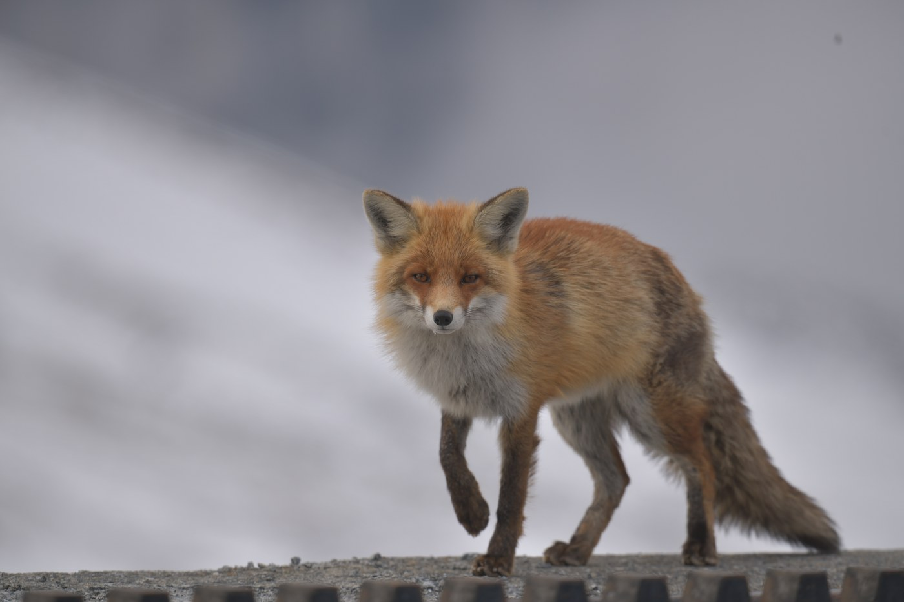

I'm a datacenter hardware engineer, mostly high-speed and RF, and I spend a lot
of weekends photographing wildlife. Lately I've gotten pretty excited about AI
too, both what it could do and the infrastructure being built for it. Here's
what I've made public. It's all gathered on my site,
[reedos.dev](https://reedos.dev/).

**[EE Labs](https://github.com/reedos/ee-labs)** ([live site](https://reedos.dev/ee-labs/))
came out of loving the math behind circuits, signals and control. There are four
interactive labs now, with 153 experiments and lessons. When you change a
parameter, the plots and numbers update together, and each number shows where it
came from. Circuit Lab can even hand a filter to Signal Lab with the same
resonance and Q. Automated tests check the explanations, and the site won't
deploy if one of them fails.

**[RF Lab Reference](https://github.com/reedos/rf_lab_reference)** ([live site](https://reedos.dev/rf_lab_reference/))
is a set of eight calculators for RF bench work, sized for a phone or tablet.
They cover power and voltage conversion, Smith chart matching, mixed-mode
S-parameters, IP3 and P1dB, sweep planning, cascaded noise and electrical delay,
and each one shows the math with your numbers in it. Nothing runs on a server,
and the link saves the whole setup.

**[Gradient Ascent](https://github.com/reedos/gradient_ascent)** ([live site](https://reedos.dev/gradient_ascent/))
is my guide to working with language models. It covers 49 techniques in eight
levels, grouped by how much the model decides on its own, and each page explains
how the technique works, what it costs and when something simpler would do.
There are also 66 examples you can run yourself. It's still in progress. The RAG
and agentic RAG pages have measured results from runs on a local 30B-class
model, and the other pages are written from primary sources for now.

**[Stack Ledger](https://github.com/reedos/stack_ledger)** ([live site](https://reedos.dev/stack_ledger/))
tracks what the AI buildout is actually delivering across energy, chips,
infrastructure, models and applications. Each event and observation is graded
on its evidence. An A means an official filing or statistic backs it up, and a D
means it hasn't been verified. Unconfirmed reports don't go on the charts.
Sources include the IEA, DOE, Epoch AI, BLS and the Census Bureau, and the
ledger can be downloaded as CSV or JSON. A model on my PC does research for it
every day, and what it finds goes up only after passing validation and an
evidence check.

**[Field Catalog](https://github.com/reedos/field-catalog)** ([installer](https://github.com/reedos/field-catalog/releases))
is the Windows app I cull and catalog my wildlife photos with. You import a card
without moving the originals, cull with the same keys as Lightroom, and compare a
whole burst side by side with pan and zoom synced, which makes it easy to see
which frame is sharp. It can also identify species with a local vision model or
an API key, keep a life list, and show on a map where you shot. Rejecting a
photo only marks it. Deleting files is a separate step, with a dry run first.

**[The Intelligence Factory](https://reedos.dev/intelligence_factory/)**
follows power, data and heat through an AI campus, from the grid to a GPU die.
Explore the hardware in 3D, change the campus scenario, and inspect the sources,
calculations and assumptions behind the numbers.

**[Photon to Photo](https://github.com/reedos/photon_to_photo)** ([live site](https://reedos.dev/photon_to_photo/))
explores a camera and lens in 3D, from light passing through the glass to charge
in a sensor and a finished photograph. Change the settings and follow the physics.

**[The Guardian Ring](https://github.com/reedos/guardian_ring)** ([live site](https://reedos.dev/guardian_ring/))
follows infrared satellite architecture from Earth orbit to a detector pixel, with
sourced civil instruments, schematic hardware, and labeled calculations.

**[Wildlife photography](https://reedos.dev/wildlife-site/)**
is my gallery of wildlife encounters, organized by species, places and photo essays,
with a life list and full-frame photographs.
